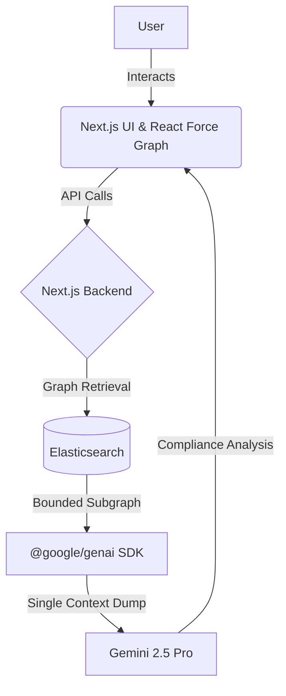

# RegChain
**AI-powered Compliance Knowledge Graph Copilot**

[](https://nextjs.org/)
[](https://reactflow.dev/)
[](https://cloud.google.com/)
[](https://deepmind.google/technologies/gemini/)
[](https://www.elastic.co/)

---

## Project Overview

**RegChain** is an AI-powered Compliance Knowledge Graph Copilot designed to revolutionize how organizations manage regulatory requirements, internal controls, and risk frameworks. By transforming static, siloed compliance documentation into a living, intelligent knowledge graph, RegChain enables organizations to dynamically build, query, and reason over their entire compliance posture.

### The Problem Statement
Compliance officers are tasked with managing hundreds of overlapping regulations, internal policies, technical controls, IT systems, known risks, audit findings, and remediation tasks. 

### Why Existing Compliance Workflows are Inefficient
Today, compliance information is heavily fragmented. It exists across static PDFs, isolated Excel trackers, scattered internal documents, audit reports, and siloed ticketing systems. 
* **Lack of Visibility:** It is nearly impossible to see how a change in one IT system impacts compliance with a specific regulation.
* **Manual Gap Analysis:** Detecting missing controls requires weeks of manual cross-referencing by expensive consultants.
* **Static Point-in-Time Audits:** Compliance is treated as an annual sprint rather than a continuous, living state.

### How RegChain Solves the Problem
RegChain ingests this fragmented knowledge and structures it into an interconnected **Compliance Knowledge Graph**. Utilizing the Google Cloud Agent Builder ecosystem (Google ADK) and Gemini 2.5 Flash, alongside an Elastic Model Context Protocol (MCP) server, RegChain acts as a dedicated AI copilot. It automatically detects gaps, proposes graph updates, maps out dependency impacts, and reasons through complex compliance queries in real-time.

---

## Key Features

RegChain operates in two distinct modes to support both the **construction** and the **auditing** of compliance graphs.

### Build Mode
Build Mode is the collaborative workspace where the AI Copilot helps compliance teams actively construct and maintain the knowledge graph.
* **AI Proposes Graph Changes:** The Gemini-powered agent continuously monitors the graph structure.
* **Gap Detection:** Automatically identifies missing controls, missing policies, missing risks, and missing regulations.
* **Suggestion Queue:** The AI generates structured proposals (e.g., "Add 'MFA Policy' to mitigate 'Credential Theft Risk'").
* **Human Approval Workflow:** Suggestions are queued in a staging area where human experts can review, modify, and explicitly approve or reject graph modifications, ensuring hallucination-free compliance.

### Analyze Mode
Analyze Mode turns the knowledge graph into a powerful querying and reasoning engine for auditors and risk managers.
* **Impact Analysis:** "If we deprecate the Legacy Auth Server, which regulatory obligations fall out of compliance?"
* **Compliance Reasoning:** Ask complex questions in natural language. The AI traverses the graph to synthesize accurate answers.
* **Explainable AI:** As the AI reasons, it visually highlights the exact traversal path on the graph canvas in real-time.
* **Audit Report Generation:** One-click generation of comprehensive audit reports covering specific subgraphs or regulations.
* **Task Prioritization:** The AI evaluates risks and missing controls to generate a prioritized remediation plan.

---

## Architecture

RegChain employs a modern architecture decoupling the user interface, the graph database, and the reasoning engine.



### Frontend
* **Next.js & React:** Provides a snappy, SSR-optimized web interface.
* **React Force Graph (2D/3D):** Renders the complex compliance graph with customized D3 physics to ensure disparate subgraphs remain highly visible and disjoint.

### Backend & Knowledge Layer
* **Next.js API Routes:** Acts as the secure middleware connecting the frontend to the AI and Elastic layers.
* **Elasticsearch:** Acts as the highly scalable backend storing all nodes (entities) and edges (relationships).

### AI Engine (Gemini 2.5 Pro)
Rather than relying on high-latency multi-step agent orchestration, RegChain utilizes a **Single-Shot Context Dump Architecture** powered by the `@google/genai` SDK and Gemini 2.5 Pro.
* **Query Translation (Gemini 2.5 Flash):** Translates the user's natural language into optimal Elasticsearch queries.
* **Bounded Subgraph Retrieval:** The backend rapidly retrieves the relevant subgraph and all interconnected edges directly from Elasticsearch.
* **Holistic Reasoning (Gemini 2.5 Pro):** The entire bounded subgraph is dumped into the massive context window of Gemini 2.5 Pro. This allows the model to reason holistically over the entire compliance posture in a single pass, resulting in dramatically faster and more coherent compliance reports without the latency of multi-step tool calling.

---

## Google Cloud & Hackathon Integration

### Deep Integration with Google GenAI
RegChain is fundamentally built around the **`@google/genai` SDK** utilizing Vertex AI mappings.
* **Gemini 2.5 Pro:** Used for the heavy lifting. By dumping the Elasticsearch graph directly into Gemini 2.5 Pro's massive context window, the model can instantly detect orphaned controls, trace compliance impacts, and propose new nodes without iterative tool-calling limits.
* **Gemini 2.5 Flash:** Used as a high-speed pre-processor to translate user intents into exact Elasticsearch DSL queries.

### Deep Integration with Elasticsearch
* **Living Knowledge Graph:** Elasticsearch acts as the permanent brain of the application, storing thousands of interconnected compliance entities.
* **Context Assembly:** When the user asks a question, the Next.js backend leverages the Elastic client to pull a structured "bounded subgraph" which is directly fed to Gemini.

---

## Knowledge Graph Structure

The RegChain graph is highly structured, mapping the real-world complexities of enterprise compliance.

### Entity Types (Nodes)
* **Regulations:** e.g., GDPR, SOC2, HIPAA
* **Policies:** e.g., Data Retention Policy, Access Control Framework
* **Controls:** e.g., MFA Enforcement, AES-256 Encryption
* **Systems:** e.g., Core Banking System, AWS S3 Bucket
* **Risks:** e.g., Credential Theft, Data Exfiltration
* **Evidence:** e.g., Q3 VAPT Audit Report
* **Tasks:** e.g., Implement SSO
* **Teams:** e.g., SecOps, Compliance

### Relationships (Edges)
* `[Control]` **mitigates** `[Risk]`
* `[Policy]` **mandates** `[Control]`
* `[System]` **governs** `[Data]`
* `[Evidence]` **applies_to** `[Control]`
* `[Task]` **remediates** `[Compliance Gap]`

**Example Subgraph:**
*(GDPR)* -> mandates -> *(Data Encryption Policy)* -> mandates -> *(AES-256 Control)* -> mitigates -> *(Data Breach Risk)* -> affects -> *(Core Banking System)*.

---

## Feature Walkthrough

Imagine you are a Compliance Officer joining a new fintech startup:

1. **Explore the Graph:** You ask the Copilot, *"Show me all systems touching PII and their associated risks."* The graph instantly highlights the Core Banking System and flags an orphaned "Vendor Data Exfiltration" risk.
2. **Detect Gaps:** You switch to Build Mode. The AI Copilot proactively alerts you: *"Detected Risk with no mitigating Controls. Suggestion: Add 'Third-Party Vendor Audit' control."*
3. **Approve Changes:** You review the suggested node and its proposed edges. You click **Approve**. The graph physically updates, closing the compliance gap.
4. **Impact Analysis:** You ask, *"What happens if we remove the Third-Party Vendor Audit control?"* The AI highlights the control in red, then visually traces a glowing path to the GDPR node, warning you of a critical compliance violation.
5. **Generate Reports:** You type, *"Generate an executive audit report for our KYC compliance."* The Copilot traverses the KYC subgraph and outputs a formatted markdown report detailing all active controls, mitigations, and team owners.

---

## Local Development

### Prerequisites
* Node.js v18+
* Docker & Docker Compose
* Google Cloud Account (for Gemini API access)

### Environment Variables
Create a `.env.local` file in the root directory:
```bash
# RegChain Environment Variables

# Elasticsearch
ELASTIC_URL=https://your-elastic-cloud-deployment.es.us-central1.gcp.elastic.cloud:443
ELASTIC_API_KEY=your_elastic_api_key

# Elastic Agent Builder MCP Server
ELASTIC_MCP_URL=https://your-elastic-cloud-deployment.kb.us-central1.gcp.elastic.cloud/api/agent_builder/mcp

# Google Cloud ADK / Agent Builder
GOOGLE_APPLICATION_CREDENTIALS=./gcp-key.json
PROJECT_ID=your-gcp-project-id
LOCATION=us-central1

# Google GenAI SDK Vertex mappings
GOOGLE_GENAI_USE_VERTEXAI=true
GOOGLE_CLOUD_PROJECT=your-gcp-project-id
GOOGLE_CLOUD_LOCATION=us-central1
```

### Installation & Setup
1. **Clone the repository:**
   ```bash
   git clone https://github.com/your-org/regchain.git
   cd regchain
   ```
2. **Start Elasticsearch (via Docker):**
   ```bash
   docker-compose up -d elasticsearch
   ```
3. **Install Dependencies:**
   ```bash
   npm install
   ```
4. **Seed the Initial Knowledge Graph:**
   ```bash
   npm run seed
   ```
5. **Run the Development Server:**
   ```bash
   npm run dev
   ```
Open [http://localhost:3000](http://localhost:3000) to view the application.

---

## Deployment

RegChain is designed to be fully containerized and deployed to **Google Cloud Run**.

1. **Build the Docker Image:**
   ```bash
   docker build -t gcr.io/your-project/regchain .
   ```
2. **Deploy to Cloud Run:**
   ```bash
   gcloud run deploy regchain \
     --image gcr.io/your-project/regchain \
     --platform managed \
     --set-env-vars="ELASTIC_NODE=https://your-elastic-cloud,GEMINI_API_KEY=secret"
   ```

---

## Project Structure

```text
regchain/
├── src/
│   ├── app/                 # Next.js App Router (API & Pages)
│   ├── components/
│   │   ├── Graph/           # React Force Graph implementations
│   │   ├── AI/              # Copilot Chat UI & Overlay
│   │   └── Inspector/       # Node/Edge property panels
│   ├── lib/
│   │   ├── ai-agent.js      # Google ADK configuration
│   │   ├── elastic.js       # Elastic client setup
│   │   └── mcp-tools.js     # Elastic MCP tool definitions
├── public/                  # Static assets
├── docker-compose.yml       # Local Elastic setup
└── package.json
```

---

## Limitations

* **Real-time Collaboration:** The current architecture supports single-user sessions per workspace. Concurrent multi-user graph editing may result in race conditions.

---

## Future Work

* **Automatic Regulation Ingestion:** Feed raw PDFs of new legislative bills directly to Gemini to automatically extract obligations and append them to the graph.
* **Continuous Compliance Monitoring:** Integrate with AWS/GCP APIs to automatically turn nodes green/red based on live cloud infrastructure state.
* **Compliance Simulation:** "Time travel" features to simulate compliance posture 6 months into the future based on the current remediation task backlog.

---

## Quick Evaluation Guide for Judges

Welcome, Judges! To quickly evaluate the core technical achievements of RegChain, please follow these steps:

**1. Launch the Project**
* Start the local server `npm run dev` and navigate to `localhost:3000`.
* The physics engine will load the default graph. Notice how distinct subgraphs are repelled to prevent spaghetti-code overlaps.

**2. Evaluate Graph Traversal (Analyze Mode)**
* Open the AI Copilot on the right panel.
* **Prompt to test:** *"Explore all KYC connections."*
* **Expected Outcome:** Gemini will utilize the Elastic MCP to execute a neighborhood search. The graph canvas will actively highlight the path from the KYC regulation down to specific IT systems.

**3. Evaluate Impact Analysis**
* **Prompt to test:** *"What happens if we completely remove the Audit Logging System?"*
* **Expected Outcome:** The AI will traverse upwards from the system, identifying orphaned controls and unmet regulations, returning a detailed impact radius.

**4. Evaluate Graph Construction (Build Mode)**
* **Prompt to test:** *"Suggest missing vendor management controls."*
* **Expected Outcome:** The AI will use ADK tools to analyze the current vendor nodes, realize a gap, and queue a specific, actionable graph insertion in the "Pending Suggestions" UI.

**5. Evaluate Agentic Output**
* **Prompt to test:** *"Generate a prioritized remediation plan based on currently active risks."*
* **Expected Outcome:** A fully formatted markdown report generated by Gemini after querying the Elastic MCP for all nodes with type `Risk` that lack a `mitigated_by` edge.
* **Bonus Testing:** You can attach raw PDF audit reports directly in the chat to have Gemini map them into the graph.
