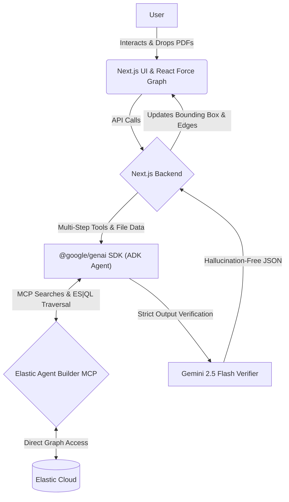

# RegChain
**AI-powered Compliance Knowledge Graph Copilot**

[](https://nextjs.org/)
[](https://reactflow.dev/)
[](https://cloud.google.com/)
[](https://deepmind.google/technologies/gemini/)
[](https://www.elastic.co/)

---

## Project Overview

**RegChain** is an AI-powered Compliance Knowledge Graph Copilot designed to revolutionize how organizations manage regulatory requirements, internal controls, and risk frameworks. By transforming static, siloed compliance documentation into a living, intelligent knowledge graph, RegChain enables organizations to dynamically build, query, and reason over their entire compliance posture.

### The Problem Statement
Compliance officers are tasked with managing hundreds of overlapping regulations, internal policies, technical controls, IT systems, known risks, audit findings, and remediation tasks. 

### Why Existing Compliance Workflows are Inefficient
Today, compliance information is heavily fragmented. It exists across static PDFs, isolated Excel trackers, scattered internal documents, audit reports, and siloed ticketing systems. 
* **Lack of Visibility:** It is nearly impossible to see how a change in one IT system impacts compliance with a specific regulation.
* **Manual Gap Analysis:** Detecting missing controls requires weeks of manual cross-referencing by expensive consultants.
* **Static Point-in-Time Audits:** Compliance is treated as an annual sprint rather than a continuous, living state.
* **Human Error & Blind Trust:** Errors caused by a single compliance officer can result in catastrophic financial and legal penalties. Without an interconnected, auditable system, organizations have no sure way to verify compliance, they simply have to blindly trust that manual workflows caught every edge case.

### How RegChain Solves the Problem
RegChain ingests this fragmented knowledge and structures it into an interconnected Compliance Knowledge Graph. Utilizing the Google Cloud Agent Builder ecosystem (Google ADK) and Gemini 2.5 Flash, alongside an Elastic Model Context Protocol (MCP) server, RegChain acts as a dedicated AI copilot. It automatically detects gaps, proposes graph updates, maps out dependency impacts, and reasons through complex compliance queries in real-time.

### Expected Client Behavior
A compliance officer opens RegChain and begins by importing existing regulations, policies, implementation documents, audit reports, and related evidence into Build Mode. The AI scans these sources and proposes new nodes and relationships for the compliance graph, such as regulations, obligations, controls, risks, systems, evidence, gaps, and tasks. The officer then reviews the suggestions, edits them if needed, and approves them one by one or in batches. This keeps the system human-in-the-loop: AI accelerates the work, but the compliance officer remains in control of the final graph.

Over time, the graph becomes the organization’s living compliance memory. New findings, meeting discussions, policy updates, and identified gaps can be added later as nodes and edges, allowing the graph to evolve with the business. This makes RegChain useful not just for initial setup, but for ongoing compliance operations and continuous monitoring.

In Analyze Mode, the user can ask questions about the graph and immediately see the most relevant subgraph highlighted. Instead of showing an opaque answer, RegChain reveals the exact part of the graph that supports the response, along with the reasoning path used to reach it. This makes the AI explainable and auditable. Even in a large, highly interconnected graph, the user can quickly focus on the nodes and relationships that matter.

Analyze Mode supports several workflows, including:
* Compliance gap analysis
* Impact analysis for policy or system changes
* Hypothetical “what if” scenarios
* Audit report generation
* Remediation prioritization
* Dependency tracing
* Compliance summaries
* Meeting brief generation
* Risk review
* Keyword search with connected subgraph expansion
* Graph version review and comparison

The user can also save graph state across versions, so the organization can track how the compliance model changes over time and compare one version against another.

---

## Key Features

### The Compliance Knowledge Graph
At the core of RegChain is the Knowledge Graph itself. It empowers users to completely visualize their entire company's workflow, infrastructure, and the legal obligations tied to them. By representing abstract legal text and internal policies as physical, interconnected nodes, users gain unprecedented clarity over how business operations map to regulatory requirements.

### Build Mode: Constructing the Graph
Build Mode is the collaborative workspace where the AI Copilot helps compliance teams actively construct and maintain the knowledge graph.

* **Document-to-Graph Generation:** Import regulations, policies, audit reports, implementation documents, meeting notes, evidence records, or other compliance artifacts. The AI analyzes the content and proposes relevant nodes and relationships. Suggested entities can include regulations, obligations, controls, policies, risks, processes, systems, teams, tasks, and evidence.
  * *Example:* Uploading an RBI circular may automatically generate RBI Digital Lending Guidelines, Customer Consent Management, Data Retention Requirements, and associated controls and risks.
* **AI-Powered Gap Detection:** Identifies potentially missing controls, policies, regulations, risks, or ownership relationships. Detects disconnected nodes and weakly governed areas of the graph, helping uncover blind spots that may not be obvious during manual review.
  * *Example:* A Data Breach Risk exists in the graph but no mitigating control is linked to it. The AI suggests adding an appropriate control.
* **Human Approval Workflow:** Every AI-generated suggestion enters a staging queue. Users can review, edit, approve, or reject each recommendation individually or in bulk. This ensures human oversight, traceable changes, and a reduced risk of incorrect graph modifications.
* **Knowledge Graph Expansion:** Add new nodes and relationships manually, or add findings from audits, meetings, incidents, regulatory updates, or risk assessments to continuously evolve the graph as the organization changes.
  * *Example:* A new vendor onboarding procedure can be added and connected to existing compliance controls and regulations.
* **Meeting & Audit Ingestion:** Convert meeting discussions and audit findings into structured graph elements. Transform recommendations, observations, and action items into nodes and relationships.
  * *Example:* An audit finding can automatically generate a Risk node, a Control Gap node, and a Remediation Task node.
* **Version History:** Save snapshots of the graph over time. Compare different versions of the compliance landscape and track how controls, risks, and regulations evolved.
  * *Example:* Compare the graph before and after implementation of a new RBI directive.

### Analyze Mode: Investigating the Graph
Analyze Mode transforms the compliance graph into an explainable reasoning and investigation engine.

* **Natural Language Compliance Queries:** Ask complex compliance questions using natural language. The AI traverses the graph to generate answers grounded in graph relationships.
  * *Example Questions:* Which controls mitigate model bias risk? What regulations govern customer onboarding? Show all obligations connected to KYC verification.
* **Explainable AI Reasoning:** Every analysis generates a replayable reasoning path. Relevant nodes and relationships are highlighted directly on the graph, allowing users to inspect exactly how the AI reached its conclusion.
  * *Example:* Instead of simply stating that a regulation is affected, the AI shows the complete path from regulation → obligation → control → system → risk.
* **Impact Analysis:** Evaluate the consequences of removing, modifying, or failing a component. Trace downstream effects across processes, controls, obligations, and regulations.
  * *Example:* "If the Core Banking System becomes unavailable, which compliance obligations are impacted?"
* **Compliance Gap Analysis:** Identify missing controls, policies, ownership structures, evidence, or regulatory mappings. Surface areas where compliance posture may be incomplete.
  * *Example:* Find risks that are not mitigated by any control.
* **Hypothetical Scenario Analysis:** Simulate incidents and proposed changes before implementation to evaluate potential compliance consequences.
  * *Example:* "What happens if customer consent records are retained for only 30 days instead of 5 years?"
* **Audit Report Generation:** Generate structured audit reports from any selected subgraph. Reports include findings, risks, impacts, regulatory exposure, and remediation recommendations.
  * *Example:* Generate an audit report for all controls related to Digital Lending compliance.
* **Remediation Prioritization:** Analyze risks and control gaps, and recommend remediation actions based on severity and impact.
  * *Example:* Prioritize unresolved compliance issues requiring immediate attention.
* **Dependency Tracing:** Trace relationships between regulations, obligations, controls, systems, teams, and risks to understand how compliance requirements propagate through the organization.
  * *Example:* Identify every system affected by a specific RBI regulation.
* **Regulatory Change Analysis:** Assess the impact of new regulations or policy updates to identify affected controls, processes, and systems.
  * *Example:* Evaluate the impact of a newly introduced RBI cybersecurity directive.
* **Graph Search & Investigation:** Search any node, keyword, regulation, control, or risk to automatically surface the connected subgraph for focused investigation.
  * *Example:* Searching "KYC" highlights related regulations, obligations, systems, controls, evidence, and risks.
* **Executive Compliance Summaries:** Generate management-ready summaries from complex graph structures, translating technical compliance relationships into business-friendly insights.
  * *Example:* Create a board-level summary of current high-risk compliance gaps.

---

## Architecture

RegChain employs a modern architecture decoupling the user interface, the graph database, and the reasoning engine.



### Frontend
* **Next.js & React:** Provides a snappy, SSR-optimized web interface.
* **React Force Graph (2D/3D):** Renders the complex compliance graph with customized D3 physics to ensure disparate subgraphs remain highly visible and disjoint.
* **Multimodal UI:** Seamlessly drag-and-drop PDFs, images, or audit reports directly into the AI Copilot.

### Backend & Knowledge Layer
* **Next.js API Routes:** Acts as the secure middleware connecting the frontend to the AI and Elastic layers.
* **Elasticsearch (via MCP):** Acts as the highly scalable backend storing all nodes (entities) and edges (relationships) utilizing custom `regchain-entities` and `regchain-relationships` indices. Note: We no longer connect to Elasticsearch using a direct client connection for AI operations; all AI intelligence is strictly mediated by the Elastic MCP.

### AI Engine (Gemini & ADK + MCP)
RegChain utilizes the **Google Agent Development Kit (ADK)** combined with an **Elastic Model Context Protocol (MCP)** server to orchestrate a powerful, completely autonomous multi-step reasoning agent.

* **Elastic MCP Integration:** Instead of writing low-level Elasticsearch queries, our backend translates ADK tool calls into `platform_core_search` and `platform_core_execute_esql` MCP requests, ferrying them securely over Server-Sent Events (SSE) directly to the Elastic Cloud.
* **Agent Orchestration & Multi-Step Thinking:** The `@google/genai` library powers an autonomous multi-step loop where **Gemini 2.5 Pro** acts as the brain. Rather than answering immediately, the Copilot pauses to "think." It actively formulates an execution plan, queries the Elastic MCP to explore graph neighborhoods, analyzes the returned JSON structures, and dynamically adjusts its traversal strategy based on intermediate findings before returning a finalized, gap-analyzed response to the user.
* **Double-Pass Guardrails:** Every node and edge retrieved by the MCP is tracked globally. A secondary **Gemini 2.5 Flash** agent evaluates the final output strictly against this tracked MCP context, guaranteeing 0% hallucination for the UI highlights.
* **Native Multimodality:** PDF Audit Reports and infrastructure images dropped into the Copilot are natively processed by Gemini 2.5 Pro alongside the graph context to perform instant compliance extraction.

---

## Google Cloud & Hackathon Integration

### Deep Integration with Google GenAI
RegChain is fundamentally built around the **`@google/genai` SDK** utilizing Vertex AI mappings.

* **Gemini 2.5 Pro:** Used for the heavy lifting. By dumping the Elasticsearch graph directly into Gemini 2.5 Pro's massive context window, the model can instantly detect orphaned controls, trace compliance impacts, and propose new nodes without iterative tool-calling limits.
* **Gemini 2.5 Flash:** Used as a high-speed pre-processor to translate user intents into exact Elasticsearch DSL queries.

### Deep Integration with Elasticsearch
* **Living Knowledge Graph:** Elasticsearch acts as the permanent brain of the application, storing thousands of interconnected compliance entities.
* **Context Assembly:** When the user asks a question, the Next.js backend leverages the Elastic client to pull a structured "bounded subgraph" which is directly fed to Gemini.

---

## Knowledge Graph Structure

The RegChain graph is highly structured, mapping the real-world complexities of enterprise compliance.

### Entity Types (Nodes)
* **Regulations:** e.g., GDPR, SOC2, HIPAA
* **Policies:** e.g., Data Retention Policy, Access Control Framework
* **Controls:** e.g., MFA Enforcement, AES-256 Encryption
* **Systems:** e.g., Core Banking System, AWS S3 Bucket
* **Risks:** e.g., Credential Theft, Data Exfiltration
* **Evidence:** e.g., Q3 VAPT Audit Report
* **Tasks:** e.g., Implement SSO
* **Teams:** e.g., SecOps, Compliance

### Relationships (Edges)
* `[Control]` **mitigates** `[Risk]`
* `[Policy]` **mandates** `[Control]`
* `[System]` **governs** `[Data]`
* `[Evidence]` **applies_to** `[Control]`
* `[Task]` **remediates** `[Compliance Gap]`

**Example Subgraph:**
*(GDPR)* -> mandates -> *(Data Encryption Policy)* -> mandates -> *(AES-256 Control)* -> mitigates -> *(Data Breach Risk)* -> affects -> *(Core Banking System)*.

---

## Local Development

### Prerequisites
* Node.js v18+
* Docker & Docker Compose
* Google Cloud Account (for Gemini API access)

### Environment Variables
Create a `.env.local` file in the root directory:
```bash
# RegChain Environment Variables

# Elasticsearch
ELASTIC_URL=https://your-elastic-cloud-deployment.es.us-central1.gcp.elastic.cloud:443
ELASTIC_API_KEY=your_elastic_api_key

# Elastic Agent Builder MCP Server
ELASTIC_MCP_URL=https://your-elastic-cloud-deployment.kb.us-central1.gcp.elastic.cloud/api/agent_builder/mcp

# Google Cloud ADK / Agent Builder
GOOGLE_APPLICATION_CREDENTIALS=./gcp-key.json
PROJECT_ID=your-gcp-project-id
LOCATION=us-central1

# Google GenAI SDK Vertex mappings
GOOGLE_GENAI_USE_VERTEXAI=true
GOOGLE_CLOUD_PROJECT=your-gcp-project-id
GOOGLE_CLOUD_LOCATION=us-central1
```

### Installation & Setup
1. **Clone the repository:**
   ```bash
   git clone https://github.com/your-org/regchain.git
   cd regchain
   ```
2. **Start Elasticsearch (via Docker):**
   ```bash
   docker-compose up -d elasticsearch
   ```
3. **Install Dependencies:**
   ```bash
   npm install
   ```
4. **Seed the Initial Knowledge Graph:**
   ```bash
   npm run seed
   ```
5. **Run the Development Server:**
   ```bash
   npm run dev
   ```
Open [http://localhost:3000](http://localhost:3000) to view the application.

---

## Deployment

RegChain is designed to be fully containerized and deployed to **Google Cloud Run**.

1. **Build the Docker Image:**
   ```bash
   docker build -t gcr.io/your-project/regchain .
   ```
2. **Deploy to Cloud Run:**
   ```bash
   gcloud run deploy regchain \
     --image gcr.io/your-project/regchain \
     --platform managed \
     --set-env-vars="ELASTIC_NODE=https://your-elastic-cloud,GEMINI_API_KEY=secret"
   ```

---

## Project Structure

```text
regchain/
├── src/
│   ├── app/                 # Next.js App Router (API & Pages)
│   ├── components/
│   │   ├── Graph/           # React Force Graph implementations
│   │   ├── AI/              # Copilot Chat UI & Overlay
│   │   └── Inspector/       # Node/Edge property panels
│   ├── lib/
│   │   ├── ai-agent.js      # Google ADK configuration
│   │   ├── elastic.js       # Elastic client setup
│   │   └── mcp-tools.js     # Elastic MCP tool definitions
├── public/                  # Static assets
├── docker-compose.yml       # Local Elastic setup
└── package.json
```

---

## Limitations

* **Real-time Collaboration:** The current architecture supports single-user sessions per workspace. Concurrent multi-user graph editing may result in race conditions.
